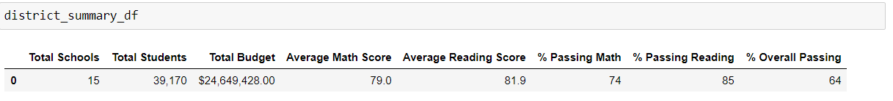
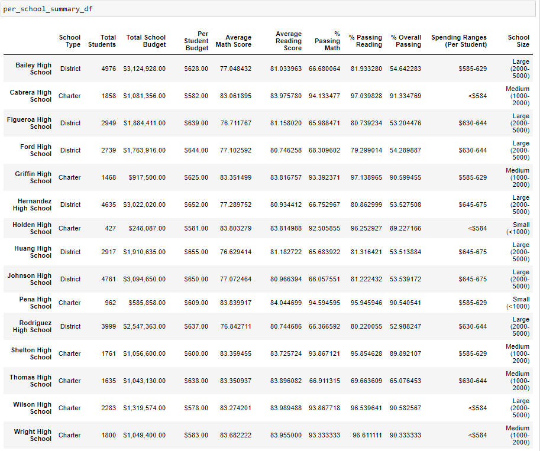
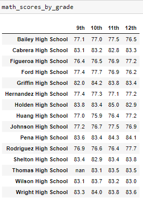
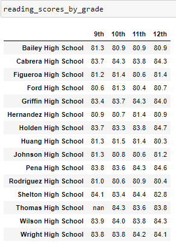
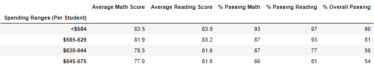
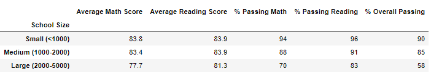
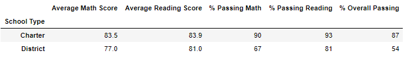

# School_District_Analysis

## 1. Overview 

The purpose of this analysis is to help Maria, the chief data scientist for a city school district, to analyze data on student's funding and student’s standardized test scores. We will work with the data to showcase trends in school performance, in order to provide useful information to the school board and superintendent for them to make decisions regarding the school budget and priorities for the year.

## 2.	Results

*o	How is the district summary affected?*

The district summary is affected on its passing percentages, as they slightly decreased. However, they do not really have any substantial changes since we only change the grades of students of 9th grade at Thomas High School. The quantity of students remains the same.

*o	How is the school summary affected?*

With the school summary we see a decrease in the passing percentages but only for the Thomas High School, as it was the only one, we changed. This information for the other schools remains the same.

*o	How does replacing the ninth graders’ math and reading scores affect Thomas High School’s performance relative to the other schools?*

It affects the percentage of general approval of Thomas High School, thus going from having 90% of student approvals in the subjects now only reflect 65%. That compared to other schools, it is not one of the best academic results they can have.

*o	How does replacing the ninth-grade scores affect the following:*

 - Math and reading scores by grade

The mentioned change affected directly this two tables, as now we do not have any data for students in 9th grade at the Thomas high School, for those subjects.

 - Scores by school spending

We can see changes at the passing percentages at this table, but only in the row of $630-644 spending range, as Thomas High School is inside this bucket (that contains the spending per student range corresponding to it).

 - Scores by school size

In this table, similar to the one above, we can only see changes at the passing percentages in the row that contains the Medium sizes schools, as Thomas High School is.

 - Scores by school type

Since Thomas High School is a charter school, only changes of the passing percentages of that row were affected. Decreasing its value like the previous tables.

## 3.	Summary

In conclusion we can say that after changing the math and reading grades of students of 9th grade at Thomas High School, and running the code all over again, the analysis results were affected only in the following points:
-	The data in district summary of Thomas High School
-	The data in the table per school summary of Thomas High School
-	The overall passing performance of Thomas High School
-	The math and reading scores by grade of Thomas High School
